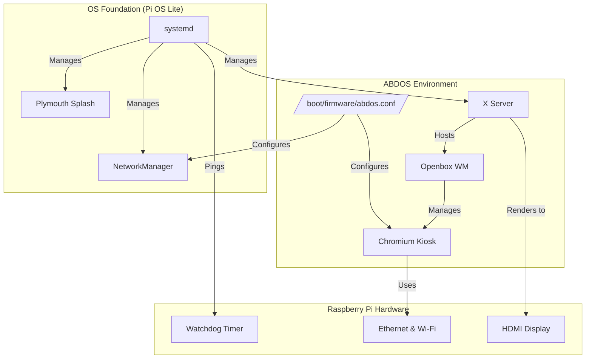
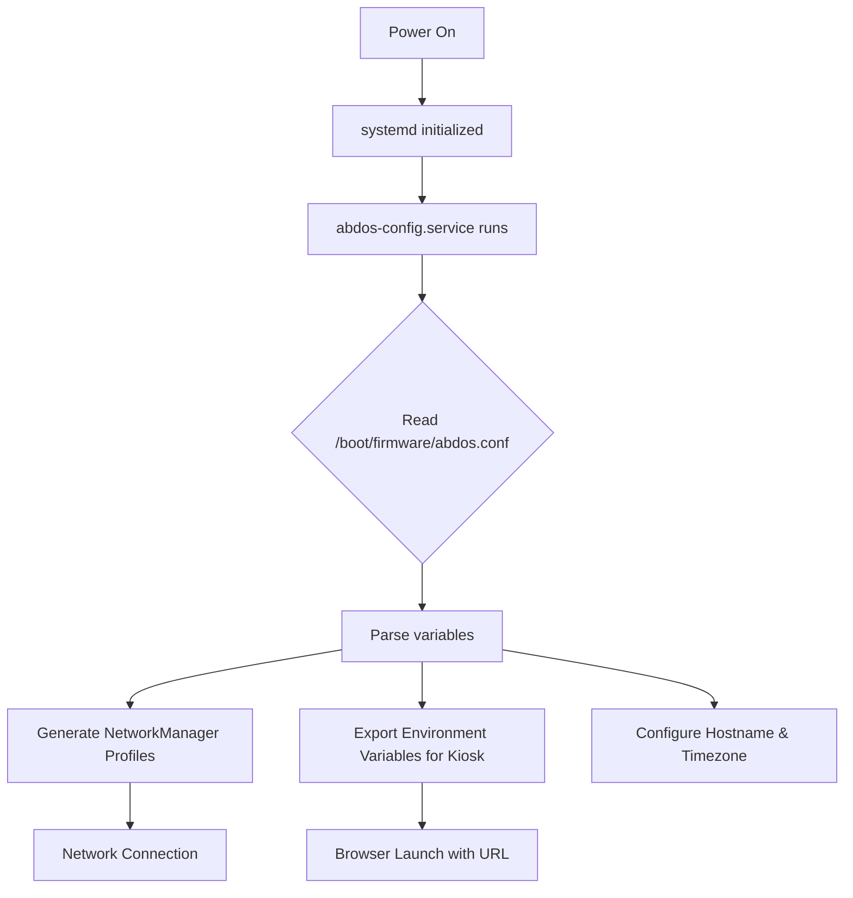
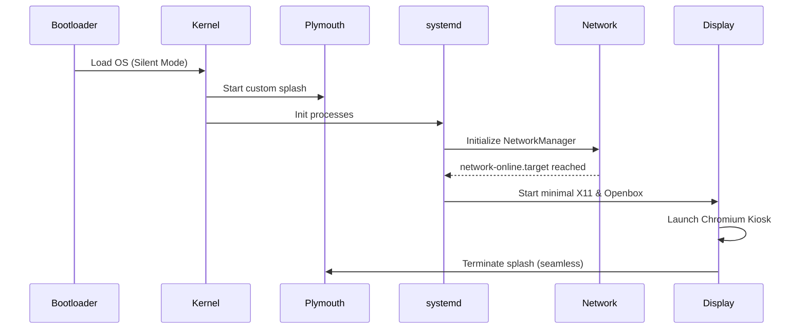
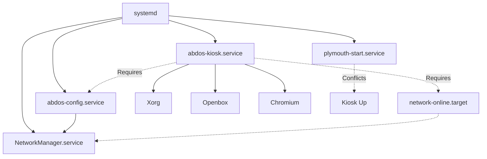
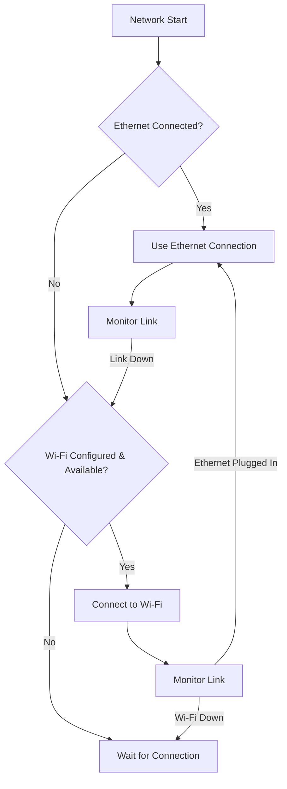
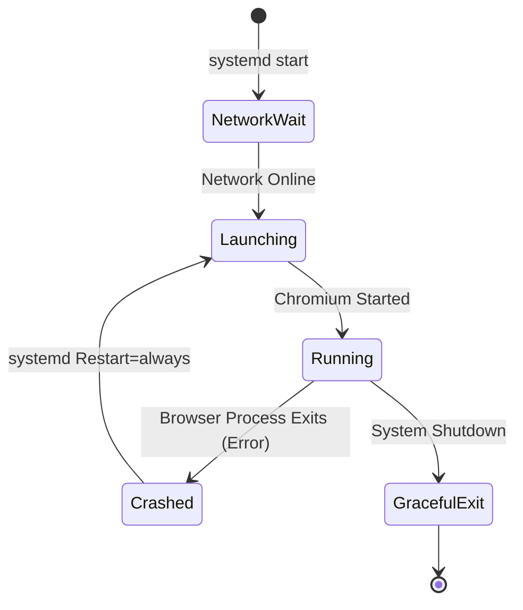
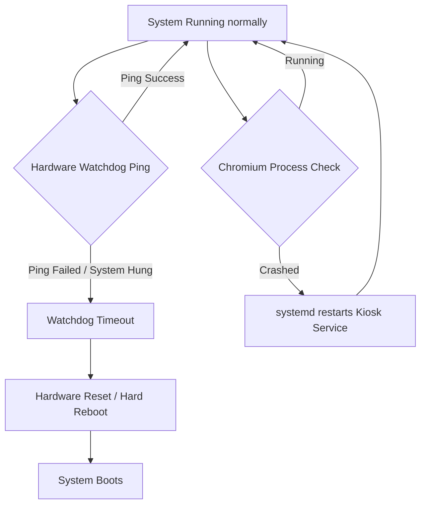
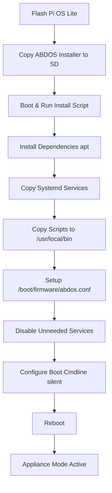

# System Architecture and Flows

This document contains Mermaid diagrams illustrating the key architectural flows of the ABDOS system.

## 1. Overall System Architecture

## 2. Configuration Flow

## 3. Boot Sequence

## 4. Service Dependency

## 5. Network Flow

## 6. Browser Lifecycle

## 7. Watchdog Recovery Flow

## 8. Installation Flow

