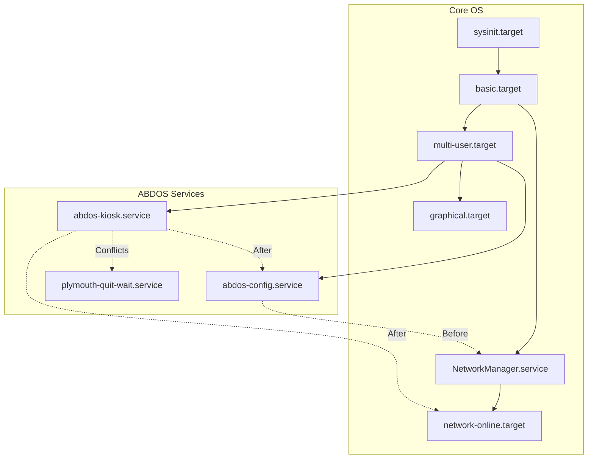

# Service Architecture

This document describes the custom systemd services introduced by ABDOS and their integration with the underlying OS.

## 1. Service Relationships

## 2. Service Definitions

### 2.1 `abdos-config.service`
*   **Purpose:** Reads `/boot/firmware/abdos.conf` and applies system-level configurations (hostname, timezone, NetworkManager profiles) before critical services start.
*   **Startup Order:** Runs early in `multi-user.target`, strictly before network interfaces are brought up fully.
*   **Dependencies:** Requires local file systems.
*   **Restart Policy:** `Type=oneshot`. Does not restart.
*   **Failure Handling:** If it fails, the system proceeds with previous configurations or defaults. Logs error to journal.

### 2.2 `abdos-kiosk.service`
*   **Purpose:** Launches the minimal X server, Window Manager, and Chromium browser.
*   **Startup Order:** Runs late in the boot process.
*   **Dependencies:** Requires `network-online.target`. Needs `abdos-config.service` to have completed successfully.
*   **Restart Policy:** `Restart=always`, `RestartSec=5`.
*   **Failure Handling:** If the X server or browser crashes, systemd will automatically attempt to restart the entire display stack.
*   **Delayed Start / Optimization:** Delays launching heavy graphics components until networking is confirmed, reducing early boot CPU contention on the Pi Zero W.

## 3. Core OS Services Impact
*   **`systemd-networkd` / `dhcpcd`:** Disabled to prevent conflicts with NetworkManager.
*   **`plymouth-quit.service`:** Behavior modified or overridden to keep the splash screen visible until `abdos-kiosk.service` signals readiness.
